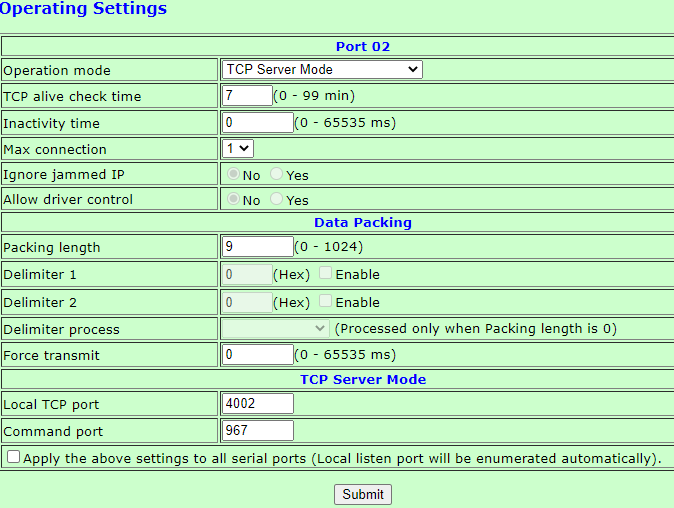
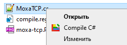

Receive Modbus RTU signals by Moxa over TCP and send them to remote server over UDP. 
In Moxa change mode to TCP server:  
​  
  
You can compile this program fast by right click menu:  
​

To make this menu you can add to register info in compile.reg file